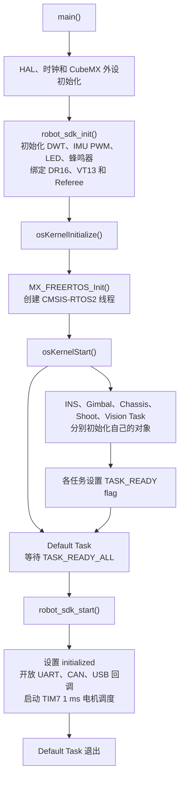

# little_head_framework

这个框架想解决的问题很直接：随着设备和功能越来越多，如果外设初始化、中断回调、设备协议和机器人控制逻辑全部写在任务里，代码很快就会互相包含，换一块板、一个电机或一种遥控器都要改很多地方。同时看到队内每台车的代码都长得不一样，换一个人都难以快速上手和维护，便有了这个项目。

写这套代码时希望尽可能打造一套易于移植和维护，逻辑清晰，模块化，松耦合，层级分明，高代码复用的框架，为此借鉴了大量开源的思路，同时也融入了一些自己的小巧思。

它并不是为了把所有东西都抽象一遍。每层只解决自己该解决的问题，上层通过稳定接口使用下层，Application 之间则通过 Message Center 交换消息。

## 框架怎么分层

```text
application  机器人模式、控制逻辑和 RTOS 任务
     |
     v
    sdk      模块间消息通信、整机启动和硬件回调路由
     |
     v
components   电机、遥控器、传感器、通信协议和算法
     |
     v
    bsp      CAN、UART、USB、TIM、PWM 和 DWT 的 HAL 封装
     |
     v
Core / Drivers / Middlewares
```

- [`bsp`](bsp/README.md) 直接面对 STM32 HAL。负责启动外设、管理缓冲区和转发中断。
- [`components`](components/README.md) 面向具体设备和算法。
- [`sdk`](sdk/README.md) 是承上启下的一层。Message Center 提供模块间通信，Robot SDK 负责当前机器人的外设启动、回调路由和电机调度。
- [`application`](application/README.md) 只关心机器人行为。Gimbal、Chassis、Shoot、INS 等模块组合底层组件，完成各自的控制逻辑。

每个目录都有自己的 README，里面记录了源文件、依赖、CMake 配置和最小使用方式。需要哪个模块，就把哪个模块和它的依赖加入工程。

## 模块是怎么组合起来的

以底盘为例，`Chassis` 中包含四个 `MotorDji` 和对应的 PID。底盘收到速度指令后，先做模式判断、运动学解算和轮速闭环，再把目标电流交给电机对象。电机组件负责维护自己的反馈和控制输出，CAN BSP 负责真正与硬件交互。

```text
Chassis
  -> mecanum kinematics
  -> wheel PID
  -> MotorDji
  -> CAN BSP
  -> motor controller
```

这样一来，Chassis 不需要处理 CAN 邮箱、接收 FIFO 或编码器报文格式；MotorDji 也不需要知道自己装在底盘、云台还是发射机构上。更换控制逻辑时尽量只改 Application，更换设备协议时尽量只改 Components，更换外设实现时则集中修改 BSP。

当前工程把同组 DJI 电机的计算和 CAN 聚合帧发送放在 Robot SDK 的 1 ms 定时器调度中。Application 只更新 target，不直接发送电机帧，避免每个任务都维护一套电机发送逻辑。

## Message Center 为什么放在中间

底盘、云台和发射机构虽然都属于 Application，但它们不应该直接拿着彼此的对象调用。否则 Gimbal 包含 Chassis，Chassis 又需要 Gimbal，很快就会形成相互依赖。

这里使用 Message Center 把“谁产生数据”和“谁使用数据”分开。例如：

```text
Message Center
├─ /dr16                 DR16             -> Command
├─ /vt13                 VT13             -> Command
├─ /command/gimbal       Command          -> Gimbal
├─ /command/chassis      Command          -> Chassis
├─ /command/shoot        Command          -> Shoot
```

发布者只需要知道 Topic 和消息结构，不知道消息最终会被谁使用；订阅者也不需要包含发布者的类。只要消息契约不变，就可以替换消息任意一端的实现。例如换一种遥控器仲裁方式，不需要修改 Gimbal、Chassis 和 Shoot。

后续如果双板需要加入板间通信也只需要订阅需要的 message 进行转发。

这版 Message Center 有意做得很简单：

- Topic 只保存最新一条消息，不维护消息队列。
- 订阅者在自己的任务周期里主动调用 `update()`，不执行回调。
- 同一个订阅者只有在序号变化时才会读到更新。
- 每次 `publish()` 都由中间层统一写入 `HAL_GetTick()` 毫秒时间戳。
- 订阅者用 `is_fresh(timeout_ms)` 处理数据失联和安全回退。
- Topic 和 payload 使用固定静态存储，不在运行时申请内存。

这种方式很适合周期控制：控制任务通常只关心现在的目标和反馈，不需要依次处理已经过期的历史指令。任务之间也不必保持完全相同的执行时刻，各自按周期读取最新值即可。

松耦合并不代表没有接口约束。`message_def.h` 中的字段、单位、坐标系和 Topic 名称就是模块之间的契约，修改它们时仍然需要检查所有发布者和订阅者。

## 为什么还有 Robot SDK

Message Center 解决的是模块之间的数据依赖，但硬件中断仍然需要找到具体对象。例如 CAN1 收到 `0x201` 后，必须知道它属于哪个底盘电机；BMI088 的 Data Ready 中断也必须唤醒 INS 任务。

这些与整车硬件连接有关的关系统一放在 [`sdk/robot`](sdk/robot/README.md) 中。Robot SDK 可以访问 Gimbal、Chassis、Shoot、INS 等全局唯一实例，并负责：

- 把 CAN、UART、USB 和 EXTI 回调路由到对应设备对象。
- 在所有 Application 完成初始化之后再启动外设回调。
- 以 1 ms 周期计算电机、发送 CAN 聚合帧。
- 定期检查遥控器、裁判系统和电机是否在线。

它是当前机器人专用的整机交互层，不是一个完全通用的设备库。换机器人时，CAN ID、串口分配、电机数量和回调映射都应该集中在这里修改，而不是散落到各个任务中。

## 移植一个模块

模块 README 中已经给出了具体配置，通常只需要完成下面几步：

1. 将模块的 `.cpp/.c` 加入 `target_sources()`。
2. 将模块目录加入 `target_include_directories()`。
3. 按 README 加入它依赖的 BSP、Components 或 SDK 模块。
4. 在 CubeMX 中开启需要的外设、DMA、GPIO 和中断。
5. 在合适的位置初始化对象、注册回调，并按推荐周期调用更新函数。

文档中的路径和硬件配置都以当前工程为例。把模块复制到其他工程后，需要根据实际目录、芯片和接线修改对应配置。

## 启动顺序



初始化被分成两段，是因为中断可能比任务更早到来。`robot_sdk_init()` 只完成不会访问 Application 对象的初始化；等所有任务都设置 Ready 标志后，`robot_sdk_start()` 才真正启动通信和电机调度。这样中断回调不会访问一个还没完成初始化的对象。

## 开发工具链

使用 VS Code 的 STM32Cube 插件提供的 `cube-cmake` 和 GNU Arm 14.3.1 工具链。

## 设计参考

本项目的分层、模块化和 Application 间 pub-sub 思路主要参考了湖南大学 RoboMaster 跃鹿战队开源的 [HNUYueLuRM/basic_framework](https://github.com/HNUYueLuRM/basic_framework)。它对 BSP、Module、Application 的职责划分，以及通过消息机制避免上层应用互相包含的设计，对这个工程影响很大。

在此基础上，这个项目结合自己的使用习惯做了一些取舍：使用 C++ 类组织设备和应用；在 BSP 与 Application 之间增加 SDK；采用无订阅回调的最新值 Message Center；由中间层统一添加消息时间戳；把当前机器人的中断路由和电机调度集中到 Robot SDK。

项目开发过程中还参考了中国科学技术大学 RoboWalker 战队开源的 [RM2025 电控培训资料](https://bbs.robomaster.com/article/18267?source=1)，深圳北理莫斯科大学 RoboMaster 北极熊战队开源的 [StandardRobot++](https://gitee.com/SMBU-POLARBEAR/StandardRobotpp)，以及大疆官方的c板例程[RoboMaster/Development-Board-C-Examples](https://github.com/RoboMaster/Development-Board-C-Examples)。
